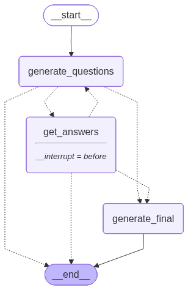

# Legal Intake Assistant Agent API

An intelligent AI-powered legal intake assistant that helps gather comprehensive information about legal cases through interactive questioning. Built with LangGraph and FastAPI, this system uses conversational AI to transform initial case descriptions into professional, structured legal summaries.

## 🎯 Overview

The Legal Intake Assistant automates the initial client intake process by:
- Asking targeted clarifying questions based on the user's initial description
- Iteratively gathering relevant facts and details
- Synthesizing information into professional case summaries
- Maintaining conversation context across multiple interactions

This tool is designed to assist legal professionals in streamlining their intake workflow while ensuring comprehensive information collection.

## ✨ Features

- **Intelligent Question Generation**: AI-driven clarifying questions tailored to each case
- **Iterative Information Gathering**: Multi-turn conversation flow with context retention
- **Professional Case Summaries**: Automated generation of structured legal case descriptions
- **Stateful Workflow**: Built on LangGraph with checkpoint management for reliable state handling
- **RESTful API**: FastAPI-based endpoints for easy integration
- **Flexible LLM Backend**: Configurable AI model support (currently using Grok via OpenRouter)

## 🏗️ Architecture

The system uses a LangGraph-based workflow with three main nodes:



### Workflow Components

1. **Generate Questions Node**: Analyzes the current state and generates 1-3 relevant clarifying questions
2. **Get Answers Node**: Interrupts workflow to collect user responses
3. **Generate Final Description Node**: Synthesizes all gathered information into a professional case summary

### State Management

The agent maintains state across interactions including:
- Initial case description
- Questions asked and answers received
- Iteration count and completion status
- Final synthesized description

## 🚀 Getting Started

### Prerequisites

- Python 3.11 or higher
- OpenRouter API key (or compatible LLM provider)
- Supabase Postgress DB Password

### Installation

1. Install uv package manager (if not already installed):

For Mac and Linux:
```bash
curl -LsSf https://astral.sh/uv/install.sh | sh
```

For Windows (PowerShell):
```powershell
powershell -ExecutionPolicy ByPass -c "irm https://astral.sh/uv/install.ps1 | iex"
```

2. Clone the repository:
```bash
git clone <repository-url>
cd Dr.-Lawyer-legal-intake-assistant
```

3. Install dependencies using uv (recommended):
```bash
cd src
uv sync
```

Or using pip:
```bash
cd src
pip install -r requirements.txt
```

4. Configure environment variables:
```bash
cp src/.env.example src/.env
```

Edit `src/.env` and add your configuration:
```env
OPENROUTER_API_KEY=your_api_key_here
APP_NAME=Legal Intake Assistant
APP_VERSION=0.1.0
DB_PASSWORD=your_BD_password
```

### Running the API

Start the FastAPI server:
```bash
cd src
uvicorn main:app --reload
```

The API will be available at `http://localhost:8000`

## 📡 API Endpoints

For detailed API examples and testing, see the [Postman Collection](./assets/Legal%20Intake%20Assistant.postman_collection.json) in the assets folder.

### Health Check
```http
GET /api/v1/
```

Returns application name and version.

### Start Legal Intake
```http
POST /api/v1/intake/start/{session_id}
```

Starts the legal intake process with an initial case description.

**Request Body:**
```json
{
  "initial_description": "مديري فالشغل بيتحرش بيا"
}
```

### Submit Intake Answers
```http
POST /api/v1/intake/answers/{session_id}
```

Submits answers to the questions generated during intake.

**Request Body:**
```json
{
  "answers": [
    "خارج مقر العمل",
    "لا الرسايل على تليفوني مورتهاش لحد",
    "مقيمة"
  ]
}
```

### Get Intake Status
```http
GET /api/v1/intake/{session_id}
```

Retrieves the current status of the intake process.

### Optimize Lawyer Offer
```http
POST /api/v1/optimize_offer
```

Takes a lawyer's offer and rephrases it to be more professional and appealing.

**Request Body:**
```json
{
  "offer": "I can take ur case for 1000 usd and insure u a 90% grante I will keep u out of jail"
}
```

**Response:**
```text
I can represent you in this case for a fee of $1,000 USD, with a strong likelihood of achieving a favorable outcome that keeps you out of legal custody.
```

## 🛠️ Technology Stack

- **FastAPI**: Modern, fast web framework for building APIs
- **LangGraph**: Framework for building stateful, multi-actor applications with LLMs
- **LangChain**: LLM application framework
- **OpenAI/OpenRouter**: LLM provider integration
- **Pydantic**: Data validation and settings management
- **Python 3.11+**: Core programming language

## 📁 Project Structure

```
Dr.-Lawyer-legal-intake-assistant/
├── src/
│   ├── main.py                 # FastAPI application entry point
│   ├── routes/
│   │   └── base.py            # API route definitions
│   ├── workflow/
│   │   ├── graph.py           # LangGraph workflow definition
│   │   ├── nodes.py           # Workflow node implementations
│   │   ├── prompts.py         # LLM prompt templates
│   │   └── state.py           # State schema definitions
│   ├── studio/                # LangGraph Studio configuration
│   ├── .env                   # Environment variables
│   └── pyproject.toml         # Project dependencies
├── assets/
│   └── workflow.png           # Workflow visualization
└── README.md
```

## 🔧 Configuration

### Environment Variables

Create a `.env` file in the `src` directory with the following variables (see `.env.example` for reference):

| Variable | Description | Required |
|----------|-------------|----------|
| `OPENROUTER_API_KEY` | API key for OpenRouter/LLM provider | Yes |
| `APP_NAME` | Application name | No |
| `APP_VERSION` | Application version | No |
| `DB_PASSWORD` | Database password (required for PostgreSQL checkpointer) | Yes |

### LLM Configuration

The default configuration uses Anthropic Claude Haiku 4.5 via OpenRouter. To change the model, edit `src/workflow/nodes.py`:

```python
llm = ChatOpenAI(
    api_key=getenv("OPENROUTER_API_KEY"),
    base_url="https://openrouter.ai/api/v1",
    model="anthropic/claude-haiku-4.5",  # Change model here
)
```

**Alternative models** that work well with this application:
- `x-ai/grok-4.1-fast` - xAI Grok model
- `openai/gpt-4o-mini` - OpenAI GPT-4 mini model
- `google/gemini-flash-2.0` - Google Gemini Flash model

## 🧪 Development

### Running Tests

```bash
cd src
python test_graph.py
```

### LangGraph Studio

For visual workflow debugging, use LangGraph Studio:

```bash
cd src/studio
langgraph dev
```

## 🚧 Current Status

**Status**: In Development

This project is currently under active development. Planned enhancements include:
- Complete API endpoint implementation
- Enhanced error handling and validation
- Integration with legal knowledge bases
- Multi-language support
- Authentication and authorization
- Case history and persistence
- Advanced analytics and reporting

## 🤝 Contributing

Contributions are welcome! Please feel free to submit a Pull Request.

## 📧 Contact

mohammedmowina@gmail.com

---

**Note**: This is an AI-assisted legal intake tool and should be used as a supplement to, not a replacement for, professional legal consultation.
